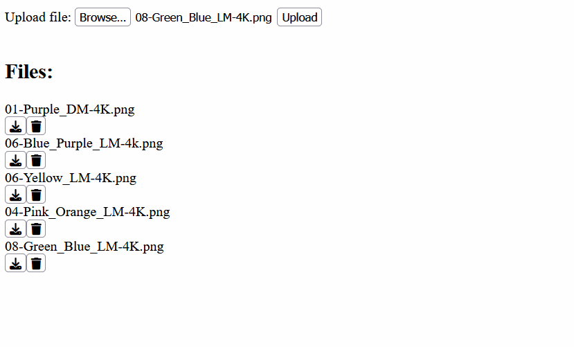

# Photo DB

A barebones google photos clone using the Java Spring Boot framework and good ol' plain JavaScript.



This project uses the H2 database and was made to prove that Java is superior to C# to one of my friends.

## Prerequisites

- [Java 23](https://www.oracle.com/java/technologies/downloads/).
- [H2](https://www.h2database.com/html/main.html)

## Installation

To get started with this project, clone the repository and execute the maven binary:
```bash
git clone https://github.com/ikugo-dev/photo-DB.git
cd photo-DB
./mvnw spring-boot:run.
```


## Usage

Go to http://localhost:8080/ and upload, download, or remove the files you want.

The limit is 100MB, but that can be changed in the `./src/main/resources/static/application.properties` file.
